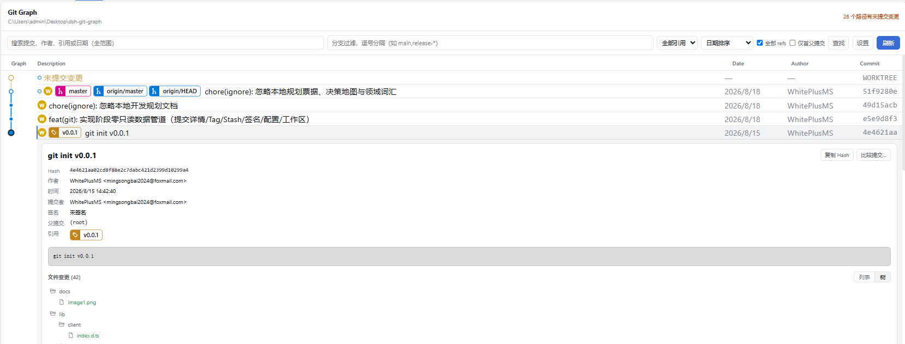

# `dsh-git-graph`


为 DeepSeek Harness Web 界面提供独立 Git Graph 视图。在 Chat 和 Trajectory 旁边打开 `Git Graph`，查看当前工作区的 Git 提交历史；刷新图谱不会在对话中生成消息，也不会写入轨迹。



## 功能

- 在 Chat 和 Trajectory 旁边提供独立的 `Git Graph` 入口。
- 显示提交拓扑、分支、合并和父提交关系。
- 显示本地分支、远程分支、tag 和 HEAD 引用标签。
- 在图谱头部显示工作区干净或存在未提交变更的状态。
- 全范围搜索提交 Hash、提交主题、作者、邮箱和引用名称。
- 按分支名 glob 过滤（如 `main,release-*`），按引用类型筛选，并选择是否包含全部 refs。
- 支持日期、作者日期、拓扑三种提交排序，以及仅首父提交模式。
- 选中提交后在**该提交行下方内联展开**详情：Hash、作者、提交者、时间、父提交、签名状态和引用标签，布局对齐 vscode-git-graph。
- 文件变更支持树 / 列表两种视图：文件夹图标与单链目录压缩、按变更类型着色、`(+增|−删)` 统计。
- 点击文件查看逐行 Diff，带新旧行号和增删高亮。
- 展开 `未提交变更` 行查看工作区文件列表和逐文件 Diff。
- 比较任意两个提交之间的文件变更。
- 在元数据条中查看仓库的 Tag 和 Stash 列表。
- 结果内查找栏：大小写敏感、正则、上一个 / 下一个跳转。
- 显示设置面板：日期 / 作者 / Hash 列开关、日期格式、图样式，按仓库持久化。
- 键盘操作：`↑` / `↓` 移动选择、`Ctrl+F` 查找、`Ctrl+Shift+F` 设置。
- 刷新当前仓库，且不会生成对话消息或工具轨迹记录。
- 按需加载更多提交，最多读取 500 条。
- 当前目录不是 Git 仓库或仓库尚无提交时显示空状态，不显示错误。

当前版本是只读版本，不会创建、删除、重命名、合并、变基、推送、拉取、Fetch、创建 tag、Stash 或重置 Git 数据。


## 打开 Git Graph

安装插件并重启 DSH Web 后，在 Chat 和 Trajectory 旁边的视图切换入口中点击 `Git Graph`。

页面读取当前会话的工作区。刷新操作直接调用插件的 Typert Remote，不会把刷新结果渲染为对话工具卡片，也不会向轨迹追加刷新事件。

## Git 数据与路径处理

Host 侧通过固定且不经过 shell 的 subprocess 参数读取 Git 数据，包括仓库状态、HEAD、有数量限制的提交历史，以及按需加载的提交详情、文件内容、文件 Diff、工作区变更和提交比较结果。

模型工具支持以下参数：

```text
git_graph({
  path?: string,          // 仓库目录，默认使用当前会话工作区
  max_commits?: number,   // 1..500，默认 100
  all?: boolean,          // 是否包含所有可达 refs，默认 true
  first_parent?: boolean, // 是否只跟随首父提交，默认 false
  glob?: string[],        // 分支名 glob 过滤（OR），提供时覆盖 --all
  search?: string,        // 全范围搜索：Hash、主题、作者、邮箱、引用名、日期
  sort?: string           // 提交排序：date、author-date 或 topological，默认 date
})
```

传入的路径只会作为 Git subprocess 的工作目录，不会拼接进 shell 命令；文件读取请求会校验路径必须位于仓库内。如果路径不是 Git 仓库，页面会显示空状态，不会显示仓库错误。尚无提交的 Git 仓库也按相同方式处理。

## 安装或更新

从 GitHub 安装 `v0.0.2`：

```powershell
dsh plugin --profile web add https://github.com/WhitePlusMS/dsh-git-graph/archive/refs/tags/v0.0.2.tar.gz
```

更新已有安装时仍然使用同一条命令。安装完成后重启 `dsh web`，让 Host 入口和浏览器客户端加载新版本。


## 卸载

从 `web` profile 卸载当前包：

```powershell
dsh plugin --profile web remove dsh-git-graph
```

## 开发

```powershell
pnpm install
pnpm run typecheck
pnpm test
pnpm run build
```

构建会把独立 Host 和浏览器端产物写入 `lib/`。从 profile 安装时使用这些构建产物，不要求 Harness monorepo checkout。


## 参考与灵感来源

本项目的诞生与参考完全基于以下开源项目：[vscode-git-graph](https://github.com/mhutchie/vscode-git-graph)，再次对其表示感谢。

## 许可证

MIT
