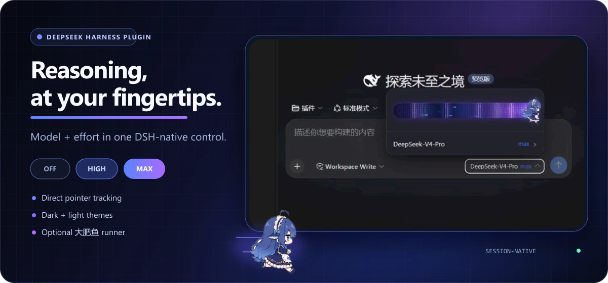
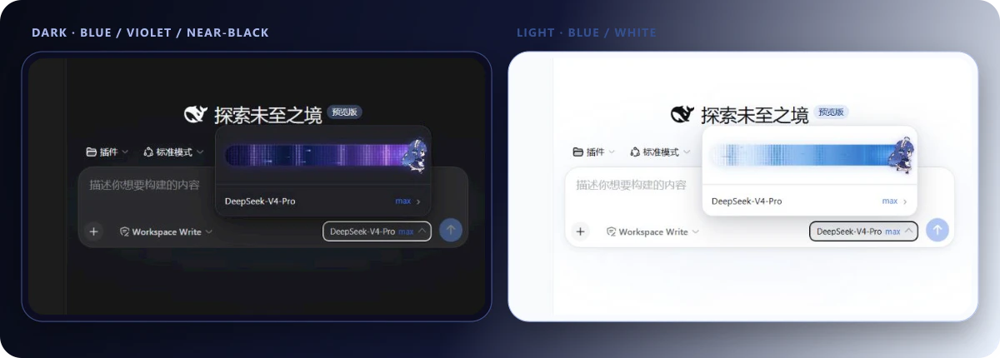

<div align="center">



# @peanutsdou/dsh-reasoning-effort

**A Codex-style model and reasoning-effort control, built directly into DeepSeek Harness.** (PeanutsDou fork, MIT licensed upstream.)

[中文首页](README.md) · [Upstream](https://github.com/HanaAyane/dsh-reasoning-effort) · [This fork](https://github.com/PeanutsDou/peanut-dsh-plugin/tree/main/dsh-reasoning-effort) · [Report an issue](https://github.com/PeanutsDou/peanut-dsh-plugin/issues)

[](https://github.com/PeanutsDou/peanut-dsh-plugin/tree/main/dsh-reasoning-effort)
[](https://github.com/deepseek-ai/deepseek-harness)
[](LICENSE)

</div>

On first launch, the plugin adds a combined model control below the DSH composer. Open it to find the reasoning-effort slider, whose levels adapt to whatever the selected model exposes, above the familiar model picker. The plugin is enabled by default and stays synchronized with DSH's `/model` command.

## First use in three steps

### 1. Install the plugin

#### Install the PeanutsDou fork

This fork lives in the [PeanutsDou/peanut-dsh-plugin](https://github.com/PeanutsDou/peanut-dsh-plugin) monorepo as package `@peanutsdou/dsh-reasoning-effort`. Deploy it with a physical copy into the web profile (link-installs are not recommended on DSH rc builds):

```powershell
cd "<your checkout>/dsh-reasoning-effort"
pnpm install
pnpm run check   # type-check and rebuild lib artifacts

$src  = "."
$dest = "$env:USERPROFILE\.dsh\profiles\web\node_modules\@peanutsdou\dsh-reasoning-effort"
Remove-Item $dest -Recurse -Force -ErrorAction SilentlyContinue
Copy-Item $src $dest -Recurse
Remove-Item "$dest\node_modules" -Recurse -Force -ErrorAction SilentlyContinue
Remove-Item "$dest\.client-build" -Recurse -Force -ErrorAction SilentlyContinue
```

Append this row to `~/.dsh/profiles/web/cordis.patch.yml`:

```yaml
- id: dsh-reasoning-effort
  name: '@peanutsdou/dsh-reasoning-effort'
```

Then run `dsh --profile web --dump-config` and verify that `name: '@peanutsdou/dsh-reasoning-effort'` is present. Restart the DSH Web Host afterwards.

### 2. Restart the DSH Web Host

The plugin loads when the Web Host starts. After installation, stop the current host, start it again, and refresh the DSH page.

### 3. Open the model control

1. Create or open a session.
2. Click the model-and-effort button below the composer.
3. Drag the thumb or click the track; release to snap to the nearest level.
4. Click the model row below the slider to enter DSH's native model list.

Your result should look like this:



## Where the levels come from

The slider renders exactly the `reasoning.efforts` the selected model exposes in the DSH model directory — count, names, and order are the model's, and the plugin adapts automatically. A common three-level combination:

| Level | Good for | Tendency |
| --- | --- | --- |
| `off` | Simple questions, rewriting, quick actions | Faster |
| `high` | Everyday coding, analysis, multi-step work | Balanced |
| `max` | Complex debugging, planning, difficult tasks | More reasoning |

DeepSeek models typically expose `off` / `high` / `max`; GLM coding models (e.g. GLM-5.2) expose five levels: `off` / `low` / `medium` / `high` / `xhigh`. The slider submits effort values exposed by the selected model; it does not bypass model or deployment limits. When a model exposes fewer than two levels, or none at all, the menu shows "current model provides no reasoning-effort levels" — see the troubleshooting section below for how to declare them.

## Enable the Big Fat Fish slider

The first installation uses the plain white thumb. To switch to the eight-frame runner:

1. Open **Settings → General**.
2. Find **Big Fat Fish slider** below Appearance.
3. Enable it and return to the model control.


The runner changes only the thumb artwork. Snapping, keyboard control, radiation effects, and model selection remain unchanged. It animates faster while dragging and freezes on a stable frame when reduced motion is enabled.

The **Reasoning effort selector** switch on the same page disables the complete enhancement without uninstalling it. DSH's built-in model selector returns immediately. Both preferences stay in the current browser.

## What the plugin adds

- **Direct pointer tracking** — the thumb follows the pointer continuously and snaps only on release.
- **Native dark and light themes** — blue-violet-black in dark mode and progressively stronger blues on white in light mode.
- **Left-only motion effects** — waves, shock pulses, pixel radiation, particles, and trails remain behind the thumb.
- **Shared DSH session state** — the slider and `/model` command use the same session model directory.
- **Automatic rollback** — a failed update restores the last confirmed selection.
- **No extra network behavior** — no plugin telemetry, credential handling, or server-side storage.

## Troubleshooting

### The slider does not appear

Check that:

1. You restarted the DSH Web Host after installation.
2. **Settings → General → Reasoning effort selector** is enabled.
3. The selected model exposes at least two effort levels in the DSH model directory (see the next entry for models without any), and thinking is not disabled by the deployment.

### A model declares no effort levels (e.g. GLM-5.3)

Models missing from pi-ai's built-in catalog carry no reasoning levels at all, and the menu shows "current model provides no reasoning-effort levels". Declare them in `~/.dsh/settings.yaml` — for GLM-5.3 on a zai coding route:

```yaml
llm-pi-ai:
  providers:
    zai-coding-cn:
      models:
        - id: glm-5.3
          name: GLM-5.3
          contextWindow: 1000000
          maxTokens: 131072
          reasoningEfforts:   # key = level shown on the slider, value = reasoning_effort sent to the API
            low: "low"
            high: "high"
            xhigh: "max"
          compat:             # the zai route's detection does not send reasoning_effort by default
            thinkingFormat: "zai"
            supportsReasoningEffort: true
```

Notes:

- Level names come from the DSH level vocabulary (`off` / `minimal` / `low` / `medium` / `high` / `xhigh`); values are the `reasoning_effort` spellings the endpoint accepts. Leaving `off` undeclared makes it unselectable, which suits models that cannot turn thinking off.
- Models already in the pi-ai catalog (e.g. GLM-5.2) inherit their levels automatically — no configuration needed.
- Once upstream catalogs include the model, the hand-written declaration can be removed; explicit entries always win over the catalog.
- Submitted levels are validated and dispatched by the host; the plugin never bypasses model or deployment limits.

### Confirm that the plugin loaded

```powershell
dsh --profile web --dump-config
```

The output should contain `name: dsh-reasoning-effort`.

### Uninstall

```powershell
dsh plugin --profile web remove dsh-reasoning-effort
```

Restart the DSH Web Host afterward. The native model selector will return automatically.

## Compatibility

| Component | Target |
| --- | --- |
| DeepSeek Harness packages | `0.1.0-rc.6` |
| Node.js | `22.19+` |
| React | `18.x` |

DeepSeek Harness is a developer preview. Upstream UI or service changes may require a matching plugin update.

## Development

```powershell
pnpm install
pnpm run check
pnpm pack
```

`pnpm run check` validates TypeScript and rebuilds both the host entry and browser module. See [design/visual-spec.md](design/visual-spec.md) for the complete interaction contract and [SECURITY.md](SECURITY.md) for vulnerability reporting.

## License

[MIT](LICENSE) © HanaAyane
